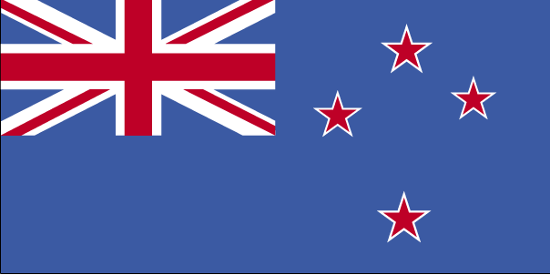

# New Zealand

New Zealand (Māori: Aotearoa [aɔˈtɛaɾɔa]) is an island country in the southwestern Pacific Ocean. It consists of two main landmasses—the North Island (Te Ika-a-Māui) and the South Island (Te Waipounamu)—and around 600 smaller islands, covering a total area of 268,021 square kilometres (103,500 sq mi). New Zealand is about 2,000 kilometres (1,200 mi) east of Australia across the Tasman Sea and 1,000 kilometres (600 mi) south of the islands of New Caledonia, Fiji, and Tonga. The country's varied topography and sharp mountain peaks, including the Southern Alps, owe much to tectonic uplift and volcanic eruptions. New Zealand's capital city is Wellington, and its most populous city is Auckland.

Owing to their remoteness, the islands of New Zealand were the last large habitable lands to be settled by humans. Between about 1280 and 1350, Polynesians began to settle in the islands, and then developed a distinctive Māori culture. In 1642, Dutch explorer Abel Tasman became the first European to sight New Zealand. In 1840, representatives of the United Kingdom and Māori chiefs signed the Treaty of Waitangi, which declared British sovereignty over the islands. In 1841, New Zealand became a colony within the British Empire and in 1907 it became a dominion; it gained full statutory independence in 1947 and the British monarch remained the head of state. Today, the majority of New Zealand's population of 5 million is of European descent; the indigenous Māori are the largest minority, followed by Asians and Pacific Islanders. Reflecting this, New Zealand's culture is mainly derived from Māori and early British settlers, with recent broadening arising from increased immigration. The official languages are English, Māori, and New Zealand Sign Language, with English being very dominant.

A developed country, New Zealand ranks highly in international comparisons of national performance, such as quality of life, education, protection of civil liberties, government transparency, and economic freedom. New Zealand underwent major economic changes during the 1980s, which transformed it from a protectionist to a liberalised free-trade economy. The service sector dominates the national economy, followed by the industrial sector, and agriculture; international tourism is a significant source of revenue. Nationally, legislative authority is vested in an elected, unicameral Parliament, while executive political power is exercised by the Cabinet, led by the prime minister, currently Jacinda Ardern. Queen Elizabeth II is the country's monarch and is represented by a governor-general, currently Dame Patsy Reddy. In addition, New Zealand is organised into 11 regional councils and 67 territorial authorities for local government purposes. The Realm of New Zealand also includes Tokelau (a dependent territory); the Cook Islands and Niue (self-governing states in free association with New Zealand); and the Ross Dependency, which is New Zealand's territorial claim in Antarctica.

New Zealand is a member of the United Nations, Commonwealth of Nations, ANZUS, Organisation for Economic Co-operation and Development, ASEAN Plus Six, Asia-Pacific Economic Cooperation, the Pacific Community and the Pacific Islands Forum.

### Government and politics

New Zealand is a constitutional monarchy with a parliamentary democracy,[69] although its constitution is not codified.[70] Elizabeth II is the queen of New Zealand[71] and thus the head of state.[72] The queen is represented by the governor-general, whom she appoints on the advice of the prime minister.[73] The governor-general can exercise the Crown's prerogative powers, such as reviewing cases of injustice and making appointments of ministers, ambassadors and other key public officials,[74] and in rare situations, the reserve powers (e.g. the power to dissolve parliament or refuse the royal assent of a bill into law).[75] The powers of the monarch and the governor-general are limited by constitutional constraints and they cannot normally be exercised without the advice of ministers.[75]

The New Zealand Parliament holds legislative power and consists of the queen and the House of Representatives.[76] It also included an upper house, the Legislative Council, until this was abolished in 1950.[76] The supremacy of parliament over the Crown and other government institutions was established in England by the Bill of Rights 1689 and has been ratified as law in New Zealand.[76] The House of Representatives is democratically elected and a government is formed from the party or coalition with the majority of seats. If no majority is formed, a minority government can be formed if support from other parties during confidence and supply votes is assured.[76] The governor-general appoints ministers under advice from the prime minister, who is by convention the parliamentary leader of the governing party or coalition.[77] Cabinet, formed by ministers and led by the prime minister, is the highest policy-making body in government and responsible for deciding significant government actions.[78] Members of Cabinet make major decisions collectively, and are therefore collectively responsible for the consequences of these decisions.[79]

A parliamentary general election must be called no later than three years after the previous election.[80] Almost all general elections between 1853 and 1993 were held under the first-past-the-post voting system.[81] Since the 1996 election, a form of proportional representation called mixed-member proportional (MMP) has been used.[70] Under the MMP system, each person has two votes; one is for a candidate standing in the voter's electorate and the other is for a party. Since the 2014 election, there have been 71 electorates (which include seven Māori electorates in which only Māori can optionally vote),[82] and the remaining 49 of the 120 seats are assigned so that representation in parliament reflects the party vote, with the threshold that a party must win at least one electorate or 5% of the total party vote before it is eligible for a seat.[83]

A block of buildings fronted by a large statue.
A statue of Richard Seddon, the "Beehive" (Executive Wing), and Parliament House (right), in Parliament Grounds, Wellington.
Elections since the 1930s have been dominated by two political parties, National and Labour.[81] Between March 2005 and August 2006, New Zealand became the first country in the world in which all the highest offices in the land—head of state, governor-general, prime minister, speaker and chief justice—were occupied simultaneously by women.[84] The current prime minister is Jacinda Ardern, who has been in office since 26 October 2017.[85] She is the country's third female prime minister.[86]

New Zealand's judiciary, headed by the chief justice,[87] includes the Supreme Court, Court of Appeal, the High Court, and subordinate courts.[88] Judges and judicial officers are appointed non-politically and under strict rules regarding tenure to help maintain judicial independence.[70] This theoretically allows the judiciary to interpret the law based solely on the legislation enacted by Parliament without other influences on their decisions.[89]

New Zealand is identified as one of the world's most stable and well-governed states.[90] As at 2017, the country was ranked fourth in the strength of its democratic institutions,[91] and first in government transparency and lack of corruption.[92] A 2017 Human Rights Report by the U.S. Department of State noted that the government generally respected the rights of individuals, but voiced concerns regarding the social status of the Māori population.[93] New Zealand ranks highly for civic participation in the political process, with 80% voter turnout during recent elections, compared to an OECD average of 68%.[94]

#### Foreign relations and military

Early colonial New Zealand allowed the British Government to determine external trade and be responsible for foreign policy.[95] The 1923 and 1926 Imperial Conferences decided that New Zealand should be allowed to negotiate its own political treaties and the first commercial treaty was ratified in 1928 with Japan. On 3 September 1939 New Zealand allied itself with Britain and declared war on Germany with Prime Minister Michael Joseph Savage proclaiming, "Where she goes, we go; where she stands, we stand."[96]

In 1951 the United Kingdom became increasingly focused on its European interests,[97] while New Zealand joined Australia and the United States in the ANZUS security treaty.[98] The influence of the United States on New Zealand weakened following protests over the Vietnam War,[99] the refusal of the United States to admonish France after the sinking of the Rainbow Warrior,[100] disagreements over environmental and agricultural trade issues and New Zealand's nuclear-free policy.[101][102] Despite the United States' suspension of ANZUS obligations the treaty remained in effect between New Zealand and Australia, whose foreign policy has followed a similar historical trend.[103] Close political contact is maintained between the two countries, with free trade agreements and travel arrangements that allow citizens to visit, live and work in both countries without restrictions.[104] In 2013 there were about 650,000 New Zealand citizens living in Australia, which is equivalent to 15% of the resident population of New Zealand.[105]

A soldier in a green army uniform faces forwards
Anzac Day service at the National War Memorial
New Zealand has a strong presence among the Pacific Island countries. A large proportion of New Zealand's aid goes to these countries and many Pacific people migrate to New Zealand for employment.[106] Permanent migration is regulated under the 1970 Samoan Quota Scheme and the 2002 Pacific Access Category, which allow up to 1,100 Samoan nationals and up to 750 other Pacific Islanders respectively to become permanent New Zealand residents each year. A seasonal workers scheme for temporary migration was introduced in 2007 and in 2009 about 8,000 Pacific Islanders were employed under it.[107] New Zealand is involved in the Pacific Islands Forum, the Pacific Community, Asia-Pacific Economic Cooperation and the Association of Southeast Asian Nations Regional Forum (including the East Asia Summit).[104] New Zealand has been described as an emerging power.[108][109] The country is a member of the United Nations,[110] the Commonwealth of Nations[111] and the Organisation for Economic Co-operation and Development (OECD),[112] and participates in the Five Power Defence Arrangements.[113]

New Zealand's military services—the Defence Force—comprise the New Zealand Army, the Royal New Zealand Air Force and the Royal New Zealand Navy.[114] New Zealand's national defence needs are modest, since a direct attack is unlikely.[115] However, its military has had a global presence. The country fought in both world wars, with notable campaigns in Gallipoli, Crete,[116] El Alamein[117] and Cassino.[118] The Gallipoli campaign played an important part in fostering New Zealand's national identity[119][120] and strengthened the ANZAC tradition it shares with Australia.[121]

In addition to Vietnam and the two world wars, New Zealand fought in the Second Boer War,[122] the Korean War,[123] the Malayan Emergency,[124] the Gulf War and the Afghanistan War. It has contributed forces to several regional and global peacekeeping missions, such as those in Cyprus, Somalia, Bosnia and Herzegovina, the Sinai, Angola, Cambodia, the Iran–Iraq border, Bougainville, East Timor, and the Solomon Islands.[125]

### Source

See more on [Wikipedia](https://en.wikipedia.org/wiki/New_Zealand)